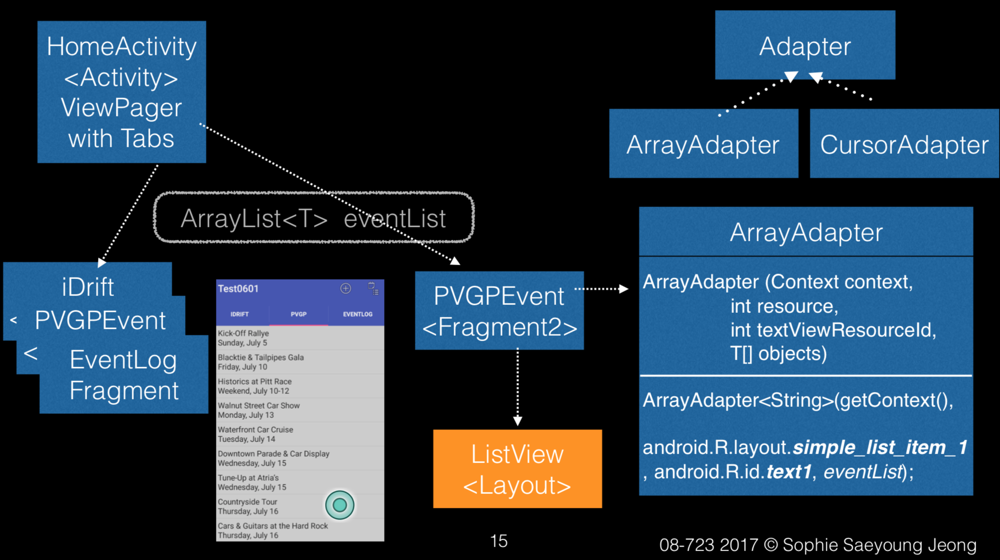
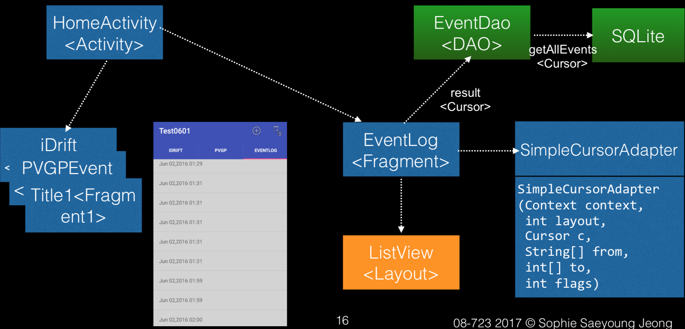

# **idrift_Android**
**iDrift mobile app for Android**
Drifting is a driving technique where the driver intentionally oversteers, with loss of traction, while maintaining control and driving the car through the entirety of a corner. And it is now considered as a motor sport. This iDrift mobile app introduces feature like checking in automobile events such as Vintage car racing, Drifting , and logging the user's drifting records while gearing up the car. This is a 08723 Mobile application development course example for Android version, and the copyright is under Saeyoung Jeong.
**iDrift architecture**
This follws MVP archiecture.

